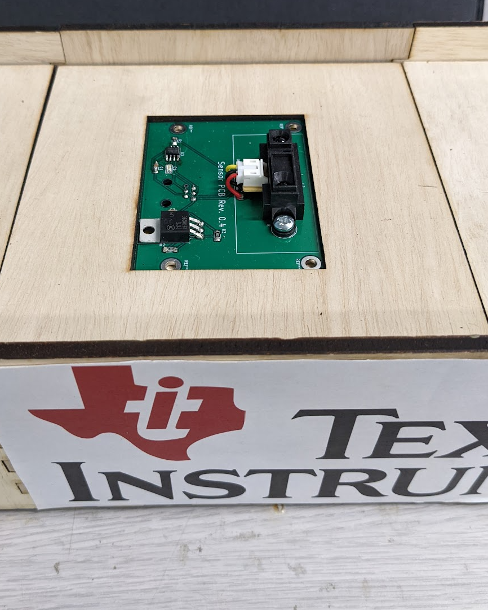
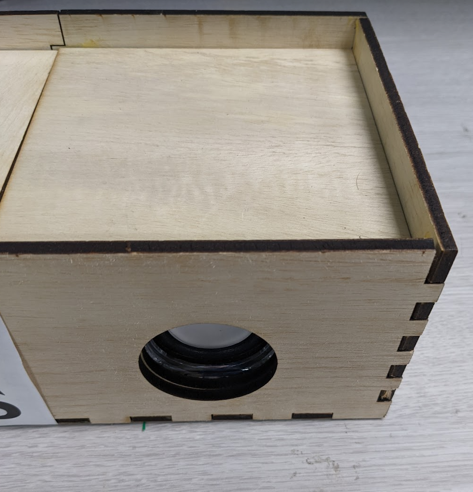

# The Aetherharp Chassis
The Aetherharp Chassis is the segmented wooden structure that houses the Aetherharp. It is broken into 9 parts: one Bela housing module, 7 sensor housing modules, and one speaker housing.

## The Bela Housing
The Bela housing module is responsible for housing the Bela board, the Bela HAT PCB, and the left speaker module. It also features holes on the back to allow access to the 9V power, Bela USB, and speaker USB cables. The manufactured Bela housing is shown in Figure 1, and the latest revision of the CAD model is shown in Figure 2

## The Sensor Housing

The sensor housing modules only have to support the sensor PCBs and provide plenty of room out of sight for cable management. They feature a top rectangular piece that hides the RJ12 connector and a bottom piece with a cutout to accomadate the RJ12 Connector.

## The Speaker Housing

The speaker housing is only responsible for containing the right speaker module and closing off the harp. It meshes with the final sensor housing stage and has a hole cut in the side to accomadate the speaker.
